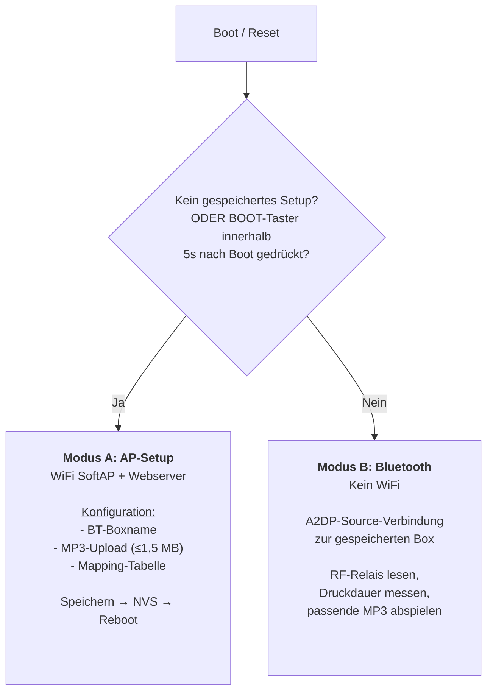

# Architektur & technische Details

## Software-Module

| Modul            | Zuständigkeit                                                                                                                            |
| ---------------- | ---------------------------------------------------------------------------------------------------------------------------------------- |
| `main.cpp`       | Boot-Logik: bei konfigurierter Box 5 s auf BOOT-Tastendruck warten, Modus (AP/Bluetooth) wählen, LED als Modus-Indikator (blinkt/an/aus) |
| `config_manager` | NVS/Preferences: Settings lesen/schreiben (BT-Name, MAC, Mapping-JSON, `configured`-Flag)                                                |
| `ap_setup`       | WiFi-AP + Webserver, Datei-Upload, Formular-Verarbeitung                                                                                 |
| `bt_audio`       | A2DP-Source (ESP32-A2DP), MP3-Decoding (arduino-audio-tools), Verbindungsaufbau, Play/Stop                                               |
| `button_mapper`  | Tastendruck-Zeitmessung auswerten, passende Datei anhand der Mapping-Tabelle ermitteln                                                   |
| `relay_control`  | GPIO4-Relaiseingang entprellt lesen                                                                                                      |

## Die zwei Betriebsmodi im Detail

WLAN und Bluetooth teilen sich beim ESP32 eine Antenne (Zeitmultiplex).
Deshalb sind die Modi strikt getrennt, siehe [Lessons Learned](/troubleshooting).



### Modus A: AP-Setup

Aktiv bei:

- erstem Boot nach dem Flashen (kein gespeichertes `configured`-Flag), sofort,
  ohne Wartezeit, **oder**
- bei einer bereits konfigurierten Box: BOOT-Taster (GPIO0) innerhalb von
  5 Sekunden **nach** dem Boot gedrückt. Die Onboard-LED blinkt während
  dieses Zeitfensters als Hinweis und leuchtet danach durchgehend, solange
  der AP-Setup-Modus aktiv ist. Bewusst _nach_ dem Boot statt während des
  Resets abgefragt. GPIO0 ist einer der Boot-Strap-Pins des ESP32; hält man
  es während eines EN-Resets gedrückt, wählt der ROM-Bootloader den
  UART-Download-Modus statt die Firmware zu starten (Details:
  [Entwicklung → Rückkehr in den Setup-Modus](/entwicklung#ruckkehr-in-den-setup-modus)).

Der ESP32 spannt ein offenes WLAN (`Paintball-Setup`, bewusst ohne Passwort,
da die Einrichtung direkt neben dem Gerät stattfindet und ein Passwort hier
keinen echten Sicherheitsgewinn brächte) auf und stellt über
einen Webserver (`ESPAsyncWebServer`) eine einfache, rein funktionale
Konfigurationsseite bereit ([`data/setup.html`](https://github.com/Roy0815/paintball-game-start-buzzer/blob/main/data/setup.html)).
Kein Bluetooth-Audio in diesem Modus. WiFi und Bluetooth teilen sich die
Antenne, siehe [Troubleshooting](/troubleshooting).

Endpunkte des Webservers:

| Endpunkt       | Zweck                                                                             |
| -------------- | --------------------------------------------------------------------------------- |
| `GET /`        | liefert `setup.html` aus LittleFS                                                 |
| `GET /files`   | JSON-Liste bereits hochgeladener MP3s (inkl. Einzelgröße) + Gesamtgröße           |
| `GET /mapping` | aktuell gespeichertes Mapping-JSON (Vorbefüllung nach Reload)                     |
| `GET /bt_name` | aktuell gespeicherter Boxname als Klartext (Vorbefüllung nach Reload)             |
| `POST /upload` | Multipart-MP3-Upload, serverseitig gegen das 1,5-MB-Gesamtlimit geprüft           |
| `POST /delete` | löscht eine einzelne MP3-Datei aus LittleFS (Formparameter `name`)                |
| `POST /save`   | speichert Boxname + Mapping-JSON in NVS, setzt `configured=true`, löst Reboot aus |

### Modus B: Bluetooth-Betrieb

Aktiv bei: `configured == true` **und** innerhalb der 5-Sekunden-Wartezeit
nach dem Boot **kein** BOOT-Tastendruck erfolgt. Kein WiFi in diesem Modus,
Onboard-LED bleibt aus.

Ablauf:

1. `bt_audio` initialisiert LittleFS und die A2DP-Source.
2. Ist bereits eine MAC-Adresse gespeichert, wird sie über
   `set_auto_reconnect()` hinterlegt, damit der A2DP-Stack einen direkten
   Verbindungsversuch unternimmt, bevor er auf Discovery zurückfällt.
3. Parallel läuft ein `set_ssid_callback`, der während der Discovery jedes
   gefundene Gerät gegen den gespeicherten Boxnamen prüft. Bei Treffer wird
   verbunden **und**, falls noch keine MAC gespeichert war, diese in NVS
   abgelegt (ab dem nächsten Boot also potenziell schnellerer Verbindungsaufbau).
4. `relay_control` liest GPIO4 entprellt aus, `button_mapper` misst die
   Druckdauer zwischen fallender und steigender Flanke.
5. Läuft bereits eine Wiedergabe, stoppt der nächste Tastendruck sie sofort
   (unabhängig von seiner Dauer). Ansonsten wird die Mapping-Tabelle nach der
   passenden Datei durchsucht und `bt_audio` startet deren Wiedergabe.

## NVS-Struktur (Namespace `buzzer`)

| Key          | Typ           | Inhalt                                                                                                 |
| ------------ | ------------- | ------------------------------------------------------------------------------------------------------ |
| `configured` | bool          | `true`, sobald einmal erfolgreich gespeichert wurde                                                    |
| `bt_name`    | string        | Name der Bluetooth-Box, wie im Setup eingegeben                                                        |
| `bt_mac`     | string        | MAC-Adresse der Box im Format `AA:BB:CC:DD:EE:FF`, leer bis zum ersten erfolgreichen Verbindungsaufbau |
| `mapping`    | string (JSON) | Tastendruck-Mapping-Tabelle, siehe unten                                                               |

## Mapping-Tabellen-Logik

Gespeichert als JSON-Objekt, Key = Dateiname in `/mp3` auf LittleFS, Value =
`[von_ms, bis_ms]`. `bis_ms` ist `null` bei der letzten (unbegrenzten) Zeile:

```json
{
  "audio1.mp3": [0, 500],
  "audio2.mp3": [501, 1500],
  "audio3.mp3": [1501, null]
}
```

`config_manager.getMapping()` parst dieses JSON, sortiert die Einträge
aufsteigend nach `von_ms` und gibt sie als Array von `MappingEntry` zurück.
`button_mapper` durchsucht dieses Array linear und wählt die erste Zeile, in
deren Bereich die gemessene Druckdauer fällt.

Das Web-UI (`setup.html`) erzeugt dieses JSON clientseitig: pro
hochgeladener Datei eine Tabellenzeile, die Nutzer:innen tragen nur den
"Bis"-Wert ein, der "Von"-Wert der Folgezeile ergibt sich automatisch aus
`bis der Vorzeile + 1`.

## Partitionsschema

4-MB-Flash, aufgeteilt in NVS (20 KB), einen einzelnen App-Slot ohne OTA
(2,25 MB, Flashen erfolgt ohnehin manuell per USB oder Browser-Flasher) und
eine LittleFS-Partition (~1,69 MB) für `setup.html` sowie die hochgeladenen
MP3-Dateien. Definiert in
[`partitions_custom.csv`](https://github.com/Roy0815/paintball-game-start-buzzer/blob/main/partitions_custom.csv).

Die App-Größe wurde anhand eines echten Builds bemessen: alle Libraries
zusammen (A2DP, arduino-audio-tools, ESPAsyncWebServer, ArduinoJson,
WiFi/Bluetooth-Stack) belegen ca. 1,88 MB. Der 2,25-MB-Slot lässt somit
knapp 20 % Luft für künftige Firmware-Änderungen. Die LittleFS-Partition
liegt weiterhin deutlich über dem 1,5-MB-MP3-Limit plus `setup.html`.
