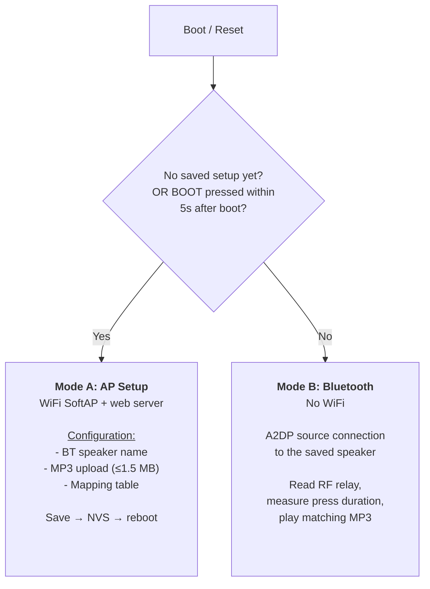

# Architecture & Technical Details

## Software modules

| Module | Responsibility |
|---|---|
| `main.cpp` | Boot logic: if already configured, wait 5s for a BOOT press, choose mode (AP/Bluetooth), LED as a mode indicator (blink/on/off) |
| `config_manager` | NVS/Preferences: read/write settings (BT name, MAC, mapping JSON, `configured` flag) |
| `ap_setup` | WiFi AP + web server, file upload, form handling |
| `bt_audio` | A2DP source (ESP32-A2DP), MP3 decoding (arduino-audio-tools), connection setup, play/stop |
| `button_mapper` | Evaluate button-press timing, determine the matching file from the mapping table |
| `relay_control` | Debounced reading of the GPIO4 relay input |

## The two operating modes in detail

WiFi and Bluetooth share a single antenna on the ESP32 (time-multiplexed).
That's why the modes are strictly separated, see [Lessons Learned](/en/troubleshooting).



### Mode A: AP Setup

Active when:
- it's the first boot after flashing (no saved `configured` flag),
  immediately, no wait, **or**
- for an already-configured device: BOOT (GPIO0) is pressed within 5 seconds
  **after** boot. The onboard LED blinks during that window as a visual cue,
  then stays solid on for as long as AP setup mode is active. Deliberately
  checked *after* boot rather than during reset itself - GPIO0
  is one of the ESP32's boot-strapping pins, and holding it during an EN
  reset makes the ROM bootloader enter UART download mode instead of
  starting the firmware (details:
  [Development → Getting back into setup mode](/en/development#getting-back-into-setup-mode)).

The ESP32 opens an open WiFi network (`Paintball-Setup`, deliberately
without a password, since setup happens right next to the device, so a
password wouldn't buy any real security here) and serves a
simple, purely functional configuration page via a web server
(`ESPAsyncWebServer`) ([`data/setup.html`](https://github.com/Roy0815/paintball-game-start-buzzer/blob/main/data/setup.html)).
No Bluetooth audio in this mode. WiFi and Bluetooth share the same
antenna, see [Troubleshooting](/en/troubleshooting).

Web server endpoints:

| Endpoint | Purpose |
|---|---|
| `GET /` | serves `setup.html` from LittleFS |
| `GET /files` | JSON list of already-uploaded MP3s (incl. individual size) + total size |
| `GET /mapping` | currently saved mapping JSON (pre-fills the form after a reload) |
| `GET /bt_name` | currently saved speaker name as plain text (pre-fills the form after a reload) |
| `POST /upload` | multipart MP3 upload, checked server-side against the 1.5 MB total limit |
| `POST /delete` | deletes a single MP3 file from LittleFS (form parameter `name`) |
| `POST /save` | saves speaker name + mapping JSON to NVS, sets `configured=true`, triggers a reboot |

### Mode B: Bluetooth Operation

Active when: `configured == true` **and** no BOOT press happens during the
5-second window after boot. No WiFi in this mode, onboard LED stays off.

Flow:
1. `bt_audio` initializes LittleFS and the A2DP source.
2. If a MAC address is already saved, it's registered via
   `set_auto_reconnect()` so the A2DP stack attempts a direct connection
   before falling back to discovery.
3. In parallel, a `set_ssid_callback` checks every device found during
   discovery against the saved speaker name. On a match, it connects
   **and**, if no MAC was saved yet, stores it in NVS (so the next boot can
   potentially connect faster).
4. `relay_control` reads GPIO4 with debouncing, `button_mapper` measures the
   press duration between the falling and rising edge.
5. If a sound is already playing, the next button press stops it
   immediately (regardless of its duration). Otherwise the mapping table is
   searched for the matching file and `bt_audio` starts playing it.

## NVS structure (namespace `buzzer`)

| Key | Type | Content |
|---|---|---|
| `configured` | bool | `true` once a setup has been saved successfully |
| `bt_name` | string | the Bluetooth speaker's name, as entered during setup |
| `bt_mac` | string | the speaker's MAC address as `AA:BB:CC:DD:EE:FF`, empty until the first successful connection |
| `mapping` | string (JSON) | the button-press mapping table, see below |

## Mapping table logic

Stored as a JSON object, key = filename in `/mp3` on LittleFS, value =
`[from_ms, to_ms]`. `to_ms` is `null` for the last (unbounded) row:

```json
{
  "audio1.mp3": [0, 500],
  "audio2.mp3": [501, 1500],
  "audio3.mp3": [1501, null]
}
```

`config_manager.getMapping()` parses this JSON, sorts the entries ascending
by `from_ms`, and returns them as an array of `MappingEntry`.
`button_mapper` searches this array linearly and picks the first row whose
range covers the measured press duration.

The web UI (`setup.html`) builds this JSON client-side: one table row per
uploaded file, where the user only fills in the "To" value. The "From"
value of the next row follows automatically from `previous row's to + 1`.

## Partition scheme

4 MB flash, split into NVS (20 KB), a single app slot without OTA (2.25 MB,
flashing is done manually via USB or the browser flasher anyway), and a
LittleFS partition (~1.69 MB) for `setup.html` and the uploaded MP3 files.
Defined in
[`partitions_custom.csv`](https://github.com/Roy0815/paintball-game-start-buzzer/blob/main/partitions_custom.csv).

The app size was sized against a real build: all libraries combined (A2DP,
arduino-audio-tools, ESPAsyncWebServer, ArduinoJson, the WiFi/Bluetooth
stack) take up about 1.88 MB. The 2.25 MB slot leaves roughly 20% headroom
for future firmware changes. The LittleFS partition still comfortably
exceeds the 1.5 MB MP3 limit plus `setup.html`.
