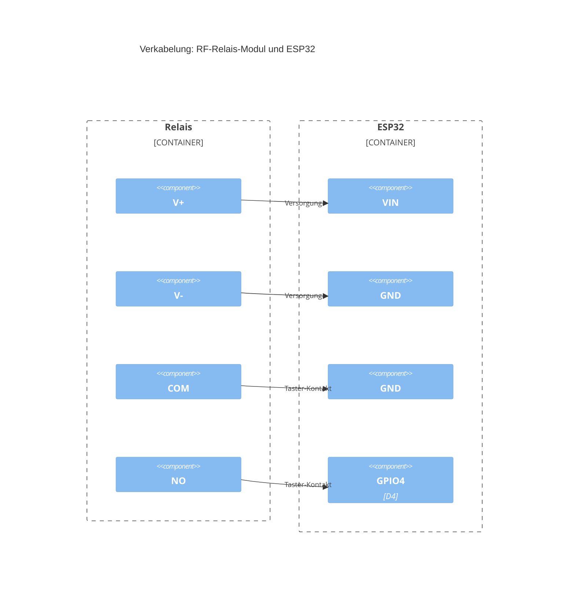

# Hardware & Verkabelung

## Komponenten

- **ELEGOO ESP32-WROOM-32 DevKit** (ASIN B0D8T7LZF2), 4 MB Flash
- **RF-Relais-Modul** als Signalquelle für den Tastendruck (Funk-Fernbedienung
  löst das Relais aus). Der Taster-Kontakt (COM/NO) wird **potentialfrei**
  verwendet. Er führt selbst keine Spannung, sondern schließt beim Auslösen
  nur einen Stromkreis, den der ESP32 über seinen internen Pull-Up erkennt.
  Das macht die Verkabelung unabhängig davon, mit welcher Spannung das
  Relais-Modul intern arbeitet.
- Bluetooth-Lautsprecher/-Box mit A2DP-Unterstützung (klassisches Bluetooth,
  kein BLE)

## Teileliste

### Einkaufsliste

| Bauteil                                         | Menge | Preis    | Hinweis                                                                                                                                          | Link                                                                     |
| ----------------------------------------------- | ----- | -------- | ------------------------------------------------------------------------------------------------------------------------------------------------ | ------------------------------------------------------------------------ |
| ESP32-WROOM-32 DevKit (z.B. ELEGOO, 4 MB Flash) | 1     | ca. 15 € | ASIN B0D8T7LZF2 (Preis und Link beziehen sich auf ein Doppelpack)                                                                                | [Amazon](https://amzn.to/4wRAqzT) \*                                     |
| RF-Relais-Modul                                 | 1     | ca. 10 € | Muss mit **5 V** betrieben werden können. Viele Relais-Module sind für 12V-Spulen ausgelegt. Beim Kauf explizit auf 5V-Kompatibilität achten.    | [Amazon](https://www.amazon.de/dp/B0DJX32J75?tag=paintball-buzzer-21) \* |
| Jumper-Kabel, Female-to-Male                    | 4     | ca. 7 €  | Für V+/V-/COM/NO zwischen Relais-Modul und ESP32, siehe Verkabelung unten. Im Elektronik-Einzelhandel meist deutlich billiger als im Online-Set. | [Amazon](https://amzn.to/4xPisik) \*                                     |

> \* Affiliate Links. Diese verursachen keine Mehrkosten, generieren aber ein paar Cent Provision. Die Produkte können auch auf jeder anderen Plattform erworben werden, ich persönlich nutze Amazon aus Bequemlichkeit.

### Vermutlich bereits vorhanden

| Bauteil                            | Hinweis                                                                                                                                     |
| ---------------------------------- | ------------------------------------------------------------------------------------------------------------------------------------------- |
| Powerbank, 5V-Ausgang              | Versorgt den ESP32 (VIN) für mobilen/batteriebetriebenen Betrieb, darüber auch das Relais-Modul (siehe [Stromversorgung](#stromversorgung)) |
| USB-C-Kabel                        | Zum Flashen sowie zur Stromversorgung ab Powerbank                                                                                          |
| Bluetooth-Lautsprecher, A2DP-fähig | Klassisches Bluetooth, kein BLE                                                                                                             |

### Case

Case aus dem 3D-Drucker für stabilen Transport und einfache Bedienung:

https://www.printables.com/model/1812252

## Verkabelung (vereinfacht)

Das folgende Diagramm zeigt nur die extern zu verkabelnden Bauteile.
BOOT-Taster und LED sitzen bereits onboard auf dem ESP32-Board und brauchen
keine eigene Verkabelung (Details dazu in der Pin-Tabelle unten):

Jede Pin-Verbindung ist eine eigene, einzeln beschriftete Beziehung
zwischen den beiden Bauteil-Boxen.

COM und NO gehören zum selben potentialfreien Kontakt: Löst die Fernbedienung
aus, schließt der Kontakt kurz COM gegen NO. Das zieht `GPIO4` (dank
internem `INPUT_PULLUP`) für die Dauer des Tastendrucks auf Low. Die
Versorgungsleitungen (V+/V-) sind ein komplett getrennter Stromkreis für
das Relais-Modul selbst.

  
  

<strong>Erweitert: Pin-Tabelle</strong>

| ESP32-Pin   | Bauteil                                     | Funktion                                                                                                                                                                                                                                                                   |
| ----------- | ------------------------------------------- | -------------------------------------------------------------------------------------------------------------------------------------------------------------------------------------------------------------------------------------------------------------------------- |
| `GPIO4`     | RF-Relais-Modul, Kontakt **NO** (Schließer) | Signal-Eingang, Tastendruck-Trigger, `INPUT_PULLUP`, aktiv Low                                                                                                                                                                                                             |
| `GND`       | RF-Relais-Modul, Kontakt **COM**            | Bezugspotential für den Taster-Kontakt                                                                                                                                                                                                                                     |
| `VIN` (5 V) | RF-Relais-Modul, **V+** (Versorgung)        | Spannungsversorgung des Relais-Moduls                                                                                                                                                                                                                                      |
| `GND`       | RF-Relais-Modul, **V-** (Versorgung)        | gemeinsame Masse, zwingend nötig, siehe unten                                                                                                                                                                                                                              |
| `GPIO0`     | BOOT-Taster (onboard)                       | kein externes Bauteil, innerhalb 5s **nach** dem Boot drücken = Setup-Modus (siehe [Entwicklung](/entwicklung#ruckkehr-in-den-setup-modus), **nicht** während Reset/EN gedrückt halten)                                                                                    |
| `GPIO2`     | Onboard-LED (blau)                          | kein externes Bauteil, blinkt während des 5s-Zeitfensters, leuchtet danach durchgehend im AP-Setup-Modus, aus im Bluetooth-Betrieb. Verifiziert am ELEGOO-Board (ASIN B0D8T7LZF2); die separate rote LED ist fest mit der Stromversorgung verdrahtet und nicht ansteuerbar |

## Bekannte Fallstricke

- **3,3 V, nicht 5 V-tolerant:** Die Logik-Pins des ESP32 vertragen dauerhaft
  nur 3,3 V. Ein direkt an einen GPIO angeschlossener 5V-Signalpegel kann den
  Chip beschädigen. Bei diesem Aufbau betrifft das nicht `GPIO4`, da der
  potentialfreie Kontakt selbst keine Spannung führt. Relevant ist es aber,
  falls das Relais-Modul später gegen eines mit direktem digitalen
  Signalausgang (z.B. ein "DATA"/"VT"-Pin statt eines Schaltkontakts)
  getauscht wird: dann vorher im Datenblatt prüfen, auf welchem Pegel dieser
  Ausgang schaltet, und im Zweifel einen Spannungsteiler oder Level-Shifter
  vorschalten.
- **VIN vs. 3,3V-Pin nicht verwechseln:** `VIN` erwartet ca. 5 V und wird
  intern auf 3,3 V geregelt. Hierüber wird das Relais-Modul versorgt. Der
  `3,3V`-Pin ist dagegen bereits geregelte Ausgangsspannung des Boards und
  darf **nicht** als Eingang für eine externe 5V-Quelle verwendet werden.
- **Versorgungsspannung und Signalpegel des Relais-Moduls trennen:** Auch
  wenn das Modul intern mit 5 V läuft (üblich bei diesen RF-Empfängern),
  betrifft das nur die V+/V--Versorgungsleitung. Der Taster-Kontakt
  (COM/NO) bleibt davon unabhängig potentialfrei. Deshalb wird hier bewusst
  dieser Kontakt statt eines etwaigen direkten Signalausgangs des Moduls
  verwendet.
- **Gemeinsame Masse nicht vergessen:** Relais-Modul-GND und ESP32-GND müssen
  verbunden sein, auch wenn beide vom selben `VIN`/`GND`-Pin-Paar versorgt
  werden. Ohne gemeinsame Masse liest `GPIO4` den Kontaktzustand nicht
  zuverlässig.
- **`GPIO0` ist ein Boot-Strap-Pin:** Anders als `GPIO4` darf `GPIO0` nicht
  während eines EN-Resets/Einschaltens auf Low liegen. Das ROM des ESP32
  sampelt den Pegel in genau diesem Moment und wählt bei Low den
  UART-Download-Modus (`waiting for download`) statt die Firmware zu
  starten. Der BOOT-Taster darf für den Rücksprung in den Setup-Modus daher
  nur **nach** einem abgeschlossenen Boot gedrückt werden, siehe
  [Entwicklung](/entwicklung#ruckkehr-in-den-setup-modus).

## Stromversorgung

Je nach Einsatzort entweder über USB (Entwicklung/Test) oder eine externe
5V-Quelle (Powerbank) an VIN. Das Relais-Modul bekommt seine 5V-Versorgung
dabei **vom ESP32**, dessen `VIN`-Pin als gemeinsamer Anschlusspunkt für
V+/V- dient (siehe Verkabelung oben), **nicht** direkt von USB oder
Powerbank. Aus der Pi-Zero-W-Vorgeschichte des Projekts (siehe
[Lessons Learned](/troubleshooting)) ist bekannt, dass eine
schwache/instabile Stromversorgung zu schwer diagnostizierbaren Aussetzern
führen kann. Insbesondere während aktiver Bluetooth-Verbindungen auf
ausreichend belastbare Versorgung achten.
